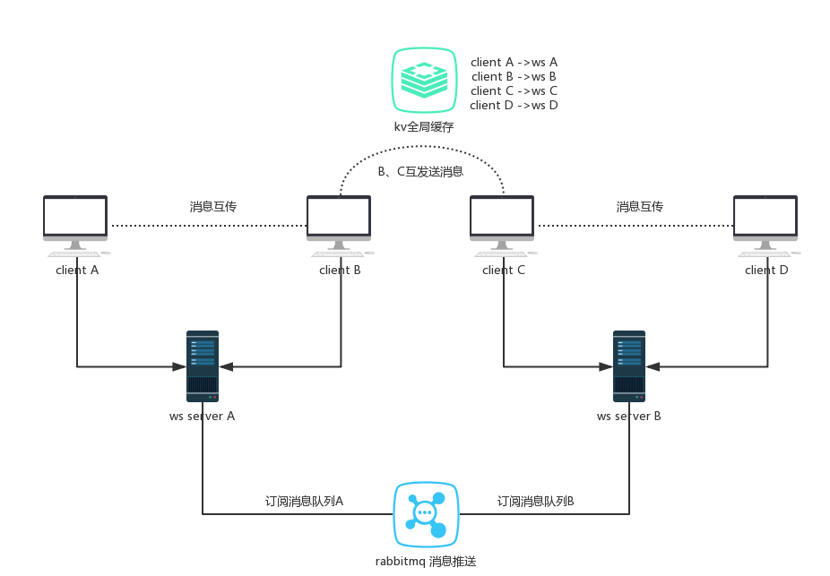

## websocket集群  (分布订阅消息（可以是轻量的redis，也可以缓存Mq消息队列中间件）)

>本来想用websocket做一个消息推送 可是分布式环境下不支持session共享因为服务器不同
所以采用 rabbitMQ+webSocket实现分布式消息推送
生产者将消息 发送给 rabbitMQ 的 virtual-host:/(顶极路由) 再由它路由到交换机 最终由交换机通过路由键指定具体的管道
消费者监听指定的管道获取消息
最终将获取的消息 交给 webSocket 被@OnMessage注解标识的方法
每次消费一条消息交给　被@OnMessage注解标识的方法 返回给前台
实现分布式实时推送

### 下面就说一下代码中会出现的问题

* [TEXT_FULL_WRITING]

java.io.EOFException（websocket自动断开连接问题）
  
* [TEXT_FULL_WRITING]

onMessage方法有返回值，导致onMessage无法被sync block控制。
session没有被同步控制，导致多线程情况下，出现IllegalStateException
session.getAsyncRemote()可能是tomcat有bug引起，依旧会出现TEXT_FULL_WRITING
  
* java.io.EOFException（websocket自动断开连接问题）

原因：使用了nginx服务，nginx配置：proxy_read_timeout(Default: 60s;)，如果一直没有数据传输，连接会在过了这个时间之后自动关闭

### 解决方法：

>客户端每过小于60s的时间就给，服务器发送一个消息，服务器不用做处理维持心跳。
proxy_read_timeout时间设置大一点（就放在上面nginx配置中就可以了）

